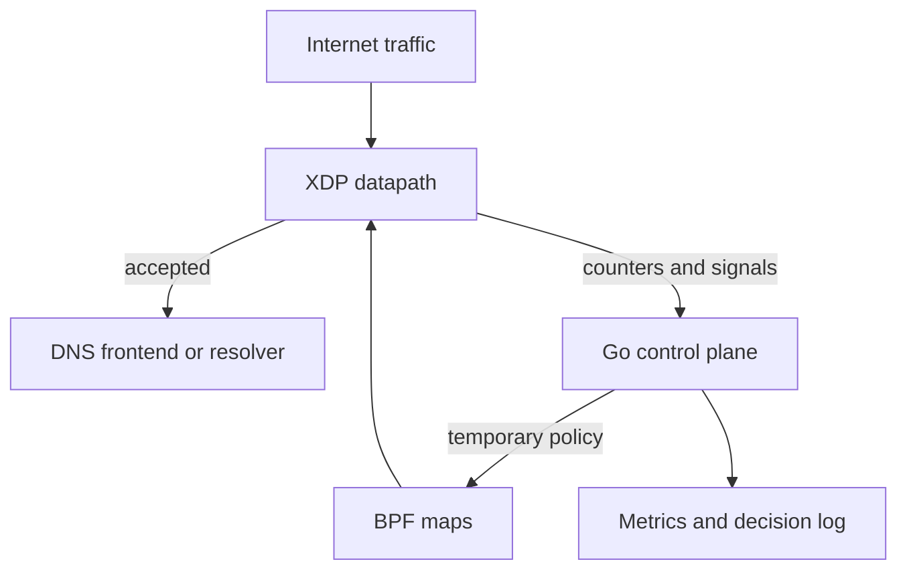

# XDP DNS Shield

**Adaptive, DNS-aware abuse mitigation at the Linux XDP layer.**

XDP DNS Shield is a work-in-progress open-source protection layer for recursive
DNS infrastructure. It combines a small eBPF/XDP datapath with a Go userspace
control plane to identify abusive traffic patterns and apply temporary,
explainable mitigation before unwanted traffic reaches the resolver.

> **Project status: pre-release / repository preparation.** A prototype has
> been evaluated on the public OpenBLD DNS infrastructure. The implementation
> is currently being separated from deployment-specific code, hardened, and
> prepared for publication. The repository intentionally contains project and
> security documentation first; it does not yet contain a supported release.

## Why this project

Recursive resolvers need application-layer context, but they should not spend
userspace resources repeatedly processing traffic that has already been
classified as abusive. Generic firewalls can drop packets early, but usually do
not participate in a DNS-aware feedback loop.

XDP DNS Shield explores a deliberately narrow design:

1. Keep packet handling in XDP minimal, bounded, and fast.
2. Export counters and signals to a userspace controller.
3. Make deterministic decisions using rates, windows, prefixes, and strike
   history.
4. Program short-lived mitigation entries back into BPF maps.
5. Expose every decision through metrics and reason codes.

It is not intended to replace upstream capacity, a DDoS scrubbing provider, or
resolver-side validation and rate limiting.

## Intended capabilities

- UDP/53 early filtering in the XDP datapath
- IPv4 and IPv6 source handling
- per-address and prefix-level traffic accounting
- deterministic window-based detection
- temporary bans with strikes and escalating TTLs
- bounded maps and predictable state expiry
- whitelist and explicit policy controls
- conservative DNS header, QTYPE, and EDNS awareness
- shadow mode before enforcement
- reason-labelled metrics and operator-visible decisions
- reproducible functional, load, and verifier tests
- deployment guidance for common open-source DNS stacks

The first public release will focus on safe, explainable mitigation. General
machine-learning anomaly detection and distributed reputation are outside the
initial scope.

## Architecture

The XDP program performs only bounded parsing, accounting, lookup, and drop/pass
actions. Detection policy, expiry, strike history, and observability remain in
userspace. See [Architecture](docs/architecture.md) and
[Threat model](docs/threat-model.md).

## Relationship to OpenBLD

[OpenBLD](https://openbld.net/) is the production reference environment that
motivated and validated the prototype. XDP DNS Shield is being designed as an
independent, reusable component. Using it must not require OpenBLD or any
OpenBLD-specific service.

## Scope and non-goals

The project protects Linux-based recursive DNS services against selected forms
of source and prefix abuse at the network edge. It does not claim to:

- stop volumetric attacks that already saturate the network link;
- replace authoritative anti-amplification controls or BCP 38;
- deeply parse arbitrary DNS messages inside eBPF;
- infer user identity or retain individual DNS query histories;
- provide a universal policy that is safe for every network;
- protect DoH or DoT application semantics inside encrypted sessions.

TCP/443 and TCP/853 signals may be considered as optional transport telemetry,
but encrypted DNS request policy belongs in the relevant frontend.

## Project plan

The work is organised into auditable phases:

1. Publish and reproduce the isolated prototype.
2. Define the threat model, safety invariants, and bounded-state model.
3. Harden the XDP datapath and reach IPv4/IPv6 parity.
4. Build the userspace adaptive mitigation controller.
5. Add shadow/enforce workflows, metrics, tests, and benchmarks.
6. Document integrations and publish a supported initial release.

See the detailed [Roadmap](docs/roadmap.md) and
[Benchmarking plan](docs/benchmarking.md).

## Getting involved

The source contribution workflow will open with the first code publication.
Design review, threat-model feedback, test scenarios, and operational DNS abuse
reports are already useful. Please read [CONTRIBUTING.md](CONTRIBUTING.md) and
[SECURITY.md](SECURITY.md) before opening an issue.

## License

The project is licensed under the [Apache License 2.0](LICENSE). Individual BPF
programs may also contain the kernel-facing license declaration required for
the helpers they use; that declaration does not change the repository license.
