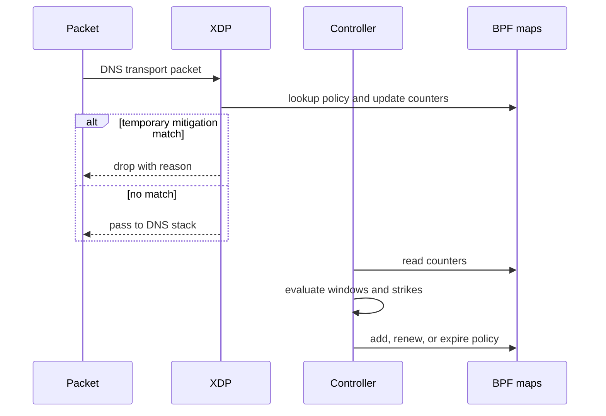

# Architecture

## Design principles

XDP DNS Shield separates fast packet handling from policy decisions. The kernel
datapath must remain small and predictable; the userspace controller may use
richer history, but every enforcement action must be bounded, explainable, and
temporary by default.

Core principles:

- fail open during controller failure unless an operator explicitly selects a
  fail-closed policy;
- no unbounded kernel or userspace state;
- no parsing beyond what is required for a safe decision;
- shadow mode before enforcement;
- monotonic expiry and recovery from stale state;
- stable reason codes for metrics and auditability;
- conservative defaults that favour avoiding false positives.

## Components

### XDP datapath

The datapath is responsible for:

- validating the relevant Ethernet/IP/UDP bounds;
- identifying the selected DNS transport;
- applying explicit whitelist and temporary mitigation lookups;
- maintaining bounded counters and coarse protocol signals;
- returning `XDP_PASS` or `XDP_DROP` with a labelled reason.

It must not implement complex adaptive policy or keep unbounded histories.

### Userspace control plane

The controller is responsible for:

- reading counters and events;
- computing per-address and per-prefix window statistics;
- evaluating deterministic thresholds and ratios;
- maintaining strike history and escalating temporary TTLs;
- writing and expiring BPF map entries;
- exporting metrics and structured decision records;
- reconciling maps after restart.

### BPF maps

The initial design expects distinct maps for configuration, counters,
whitelists, temporary per-address mitigation, and temporary prefix mitigation.
Exact types and capacities will be documented alongside the implementation.
Every mutable map requires an explicit capacity and eviction/expiry policy.

## Decision flow

## Deployment modes

- **Observe:** collect counters only; never add drop policy.
- **Shadow:** evaluate decisions and report what would be dropped.
- **Enforce:** install temporary mitigation entries.

Moving from shadow to enforce must be an explicit operator action. A deployment
should be able to return to shadow mode without unloading the XDP program.

## Integration boundary

The first release targets a standalone Linux service attached to a selected
network interface. It should be deployable in front of Unbound, Knot Resolver,
PowerDNS Recursor, dnsdist, or another DNS stack without modifying that stack.
Optional application feedback integrations may be added later through a stable,
documented interface.

