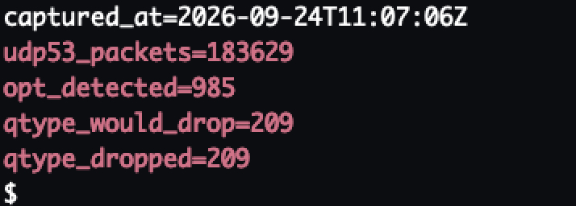

# Prototype evidence

This document summarises operational evidence from the existing private, deployment-specific XDP DNS Shield prototype. The prototype has been evaluated on the public OpenBLD DNS infrastructure under real Internet traffic.

The purpose of this document is to demonstrate technical feasibility. It is not a performance benchmark, an independent security assessment, or a claim that the current prototype is ready for third-party deployment.

**Evidence snapshot:** September 2026
**Environment:** Linux-based OpenBLD production edge
**Public implementation status:** source publication is planned after the prototype has been separated from OpenBLD-specific deployment code and reviewed for security, privacy, and reproducibility.

## Validated architecture

The deployed prototype follows the architecture described in [Architecture](architecture.md):

1. A bounded eBPF/XDP datapath performs packet classification, accounting, and policy lookups before accepted traffic reaches the service.
2. A Go userspace controller reads counters and coarse traffic signals.
3. The controller evaluates deterministic rate windows, address and prefix activity, and strike history.
4. Temporary mitigation decisions are written back to BPF maps.
5. Operator-visible counters and structured log events explain the active decisions.

## Observed capabilities

The following capabilities were observed in the private production prototype. Only aggregate or anonymised observations are reported here.

| Capability            | Operational observation                                                                                                    |
| --------------------- | -------------------------------------------------------------------------------------------------------------------------- |
| UDP/53 accounting     | The XDP datapath exported active UDP/53 packet counters to userspace.                                                      |
| DNS-aware signals     | EDNS/OPT detections and QTYPE policy counters were recorded.                                                               |
| Address mitigation    | Temporary IPv4 and IPv6 mitigation entries were active and exposed their remaining lifetime.                               |
| Prefix mitigation     | Temporary prefix-level policy was active for both IPv4 and IPv6 traffic.                                                   |
| Strike history        | Repeated prefix activity advanced through successive strike levels.                                                        |
| TTL escalation        | Observed prefix mitigation lifetimes increased from 15 minutes to 30 minutes and then to 60 minutes for repeated activity. |
| Automatic expiry      | Temporary address and prefix entries reported bounded expiry instead of becoming permanent implicitly.                     |
| Explainable decisions | The controller exposed rates, observation windows, strike level, selected TTL, and labelled pass/drop/would-drop counters. |
| Operator inspection   | Active address and prefix policies could be inspected from the command line.                                               |

These observations show that the feedback loop between the XDP datapath, userspace policy evaluation, and BPF maps is operational. They do not establish universal thresholds or prove that the same policy is safe for every network.

### Anonymised production snapshot

The following snapshot contains selected DNS-related counters exported by the private prototype on an OpenBLD production edge. Host identifiers, source addresses, network prefixes, and unrelated experimental transport counters have been excluded.

The snapshot shows active UDP/53 accounting, EDNS/OPT recognition, and QTYPE policy enforcement. The values represent a single operational observation captured on 24 September 2026 and are provided as evidence of the working datapath and userspace telemetry. They are not benchmark results.

## Relationship to the planned public project

The deployed prototype contains OpenBLD-specific configuration and experimental transport controls that are outside the initial public DNS-focused scope. The public project will not be a direct publication of a production deployment.

The planned work is to extract and harden a reusable component with:

* a minimal verifier-friendly XDP datapath;
* IPv4 and IPv6 parity;
* bounded maps with documented capacity behaviour;
* deterministic per-address and prefix-level mitigation;
* observe, shadow, and enforce modes;
* stable reason codes and aggregate metrics;
* restart and expiry reconciliation;
* synthetic functional, verifier, fuzz, and load tests;
* reproducible benchmarks and deployment documentation.

OpenBLD will remain a reference validation environment. Use of the public component must not require OpenBLD or any OpenBLD-specific service.

## Evidence handling and privacy

Raw, unredacted production screenshots and logs are not published because they
contain source addresses, network prefixes, host identifiers, and
deployment-specific operational data. Only selected anonymised aggregate
evidence may be published. This approach is consistent with the project's
privacy and security principles.

The public evidence set does not contain:

* client or source IP addresses;
* DNS query names or individual query histories;
* customer information;
* host credentials, secrets, or private configuration;
* raw production packet captures;
* reusable attack or bypass details.

Production-derived test cases will be reconstructed as synthetic traffic profiles before publication. Published benchmark results will include the tested commit, kernel and NIC context, configuration, traffic profile, and aggregate results required for reproduction.

## Current limitations

* The implementation has not yet been published as a supported release.
* The observations have not been independently reproduced or audited.
* The evidence demonstrates operation of selected mechanisms, not protection against link-saturating volumetric attacks.
* No false-positive rate is claimed until labelled synthetic scenarios and a documented evaluation method are published.
* Experimental non-DNS transport controls in the private deployment are not a commitment for the initial public release.
* Production counters are intentionally omitted here because values without a precise observation interval and workload definition would be misleading.

## Planned reproducible evidence

The first public releases are expected to replace these operational observations with reproducible evidence, including:

1. synthetic DNS traffic profiles without production identifiers;
2. functional tests for pass, shadow, and enforce behaviour;
3. IPv4 and IPv6 address and prefix scenarios;
4. verifier, malformed-packet, map-pressure, expiry, and restart tests;
5. throughput and CPU measurements against a documented baseline;
6. false-positive and recovery analysis for labelled scenarios;
7. benchmark scripts, configurations, aggregate results, and tested commit IDs.

See the [Benchmarking plan](benchmarking.md), [Threat model](threat-model.md), and [Roadmap](roadmap.md) for the corresponding publication and safety requirements.
